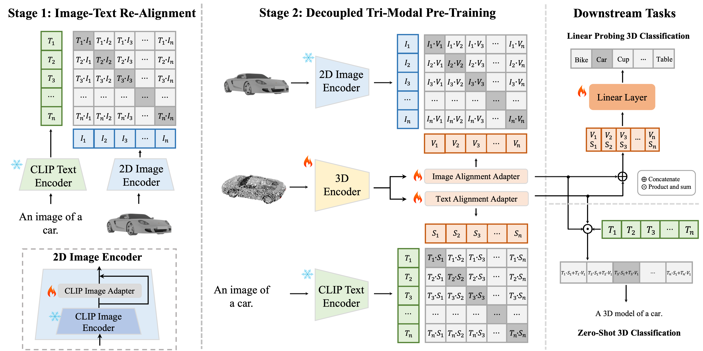

<div align='center'>

<h2><a href="https://alanzhangcs.github.io/tamm-page/">TAMM: TriAdapter Multi-Modal Learning for 3D Shape Understanding</a></h2>

[Zhihao Zhang](https://alanzhangcs.github.io/)<sup>1*</sup>, [Shengcao Cao](https://shengcao.netlify.app/)<sup>
2*</sup>, [Yuxiong Wang](https://yxw.web.illinois.edu/)<sup>2</sup>

<sup>1</sup>[XJTU](https://www.xjtu.edu.cn/), <sup>2</sup>[UIUC](https://illinois.edu/) <br><sup>*</sup> Equal
Contribution

CVPR 2024
</div>

<p align="center">
    
</p>

We introduce TriAdapter Multi-Modal Learning (TAMM) -- a novel two-stage learning approach based on three synergetic
adapters. First, our CLIP Image Adapter mitigates the domain gap between 3D-rendered images and natural images, by
adapting the visual representations of CLIP for synthetic image-text pairs. Subsequently, our Dual Adapters decouple the
3D shape representation space into two complementary sub-spaces: one focusing on visual attributes and the other for
semantic understanding, which ensure a more comprehensive and effective multi-modal pre-training.

## Schedule

We are committed to open-sourcing TAMM related materials, including:


- [x] Evaluation code
- [x] Evaluation data
- [x] Pretraining code
- [x] Pretrained checkpoints
- [ ] Downstream tasks implementation
## Installation

Clone this repository and install the required packages:

```
conda create -n tamm python=3.9
conda activate tamm
conda install pytorch==1.13.0 torchvision==0.14.0 torchaudio==0.13.0 pytorch-cuda=11.6 -c pytorch -c nvidia
pip install -U git+https://github.com/NVIDIA/MinkowskiEngine
conda install -c dglteam/label/cu113 dgl
pip install huggingface_hub tqdm
```

## Model Zoo

|                                             Model                                              |   Training Data    | Objaverse-LVIS Top1 (Top5) | ModelNet40 Top1 (Top5) | ScanObjectNN Top1 (Top5) |
|:----------------------------------------------------------------------------------------------:|:------------------:|:--------------------------:|:----------------------:|:------------------------:|
| [**PointBert**](https://huggingface.co/zhihao406/tamm-models/blob/main/tamm_pointbert_no_lvis.pt) | Ensembled w/o LVIS |        43.5 (72.3)         |      86.2 (97.9)       |       55.9 (88.2)        | 
|      [**PointBert**](https://huggingface.co/zhihao406/tamm-models/blob/main/tamm_pointbert_ensemble.pt)      |     Ensembled      |        51.9 (81.3)         |      86.1 (97.8)       |       57.0 (86.8)        | 
|  [**PointBert**](https://huggingface.co/zhihao406/tamm-models/blob/main/tamm_pointbert_shapenet.pt)  |      ShapeNet      |        13.7 (29.2)         |      73.2 (91.8)       |       54.3 (83.6)        | 


## Pre-training

1. Please refer to [here](https://github.com/Colin97/OpenShape_code) for pre-train dataset preparation and put it in the data folder. The folder should look like this:
```
├── data
│   ├── objaverse_processed
│   │   ├── merged_for_training_all
│   │   │   ├── ...
│   │   └── supporting_data
│   │       └── ...
│   meta_data
```

2. Run the pre-training stage1 by the following command:

```
CUDA_VISIBLE_DEVICES=0,1,2,3  torchrun  --nproc_per_node=4 --master_port=29001 main.py --config configs/clip_image_adapter_training.yaml
```

3. Run the pre-training stage2 by the following command:

```
CUDA_VISIBLE_DEVICES=0,1,2,3  torchrun  --nproc_per_node=4 --master_port=29001 main.py --config configs/pointbert.yaml
```

## Inference
Run the zero-shot evaluation by the following command

```
CUDA_VISIBLE_DEVICES=0,1,2,3  torchrun  --nproc_per_node=4 --master_port=29001 test.py --config configs/Pre-training/pointbert.yaml --resume /path/to/pre-trained-models
```

## Acknowledgement

TAMM is built using the
awesome  [OpenCLIP](https://github.com/mlfoundations/open_clip), [ULIP](https://github.com/salesforce/ULIP), [OpenShape](https://github.com/Colin97/OpenShape_code) and [Uni3D](https://github.com/baaivision/Uni3D). 


## Citation
```bib
@article{zhang2024tamm,
  title={TAMM: TriAdapter Multi-Modal Learning for 3D Shape Understanding},
  author={Zhang, Zhihao and Cao, Shengcao and Wang, Yu-Xiong},
  journal={arXiv preprint arXiv:2402.18490},
  year={2024}
}
```


